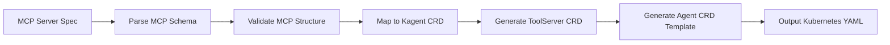

# Kagent CRD Schemas and MCP Conversion Mapping

## Overview

This document outlines the Kagent CRD schemas for AI Tool-Servers and Tools, and provides a mapping strategy for converting MCP (Model Context Protocol) servers and tools into Kagent CRD format.

## Kagent CRD Resources

### 1. Agent CRD Schema

```yaml
apiVersion: kagent.dev/v1alpha1
kind: Agent
metadata:
  name: <agent-name>
  namespace: <namespace>
spec:
  description: <agent-description>
  modelConfig: <model-config-name>
  systemMessage: |
    <system-prompt-instructions>
  tools:
    - type: McpServer
      mcpServer:
        toolServer: <toolserver-name>
        toolNames:
          - <tool-name-1>
          - <tool-name-2>
    - builtin:
        name: <builtin-tool-name>
        type: Builtin
```

### 2. ToolServer CRD Schema

```yaml
apiVersion: kagent.dev/v1alpha1
kind: ToolServer
metadata:
  name: <toolserver-name>
  namespace: <namespace>
spec:
  description: <toolserver-description>
  config:
    sse:
      url: <mcp-server-url>
    # Alternative configurations:
    # stdio: {}
    # websocket:
    #   url: <websocket-url>
```

### 3. ModelConfig CRD Schema

```yaml
apiVersion: kagent.dev/v1alpha1
kind: ModelConfig
metadata:
  name: <model-config-name>
  namespace: <namespace>
spec:
  provider: <provider-name>  # openai, anthropic, etc.
  model: <model-name>
  # Additional provider-specific configuration
```

## MCP Protocol Schema Structure

### MCP Server Schema
```json
{
  "server": {
    "name": "server-name",
    "version": "1.0.0"
  },
  "capabilities": {
    "tools": {},
    "resources": {},
    "prompts": {}
  },
  "tools": [
    {
      "name": "tool-name",
      "description": "tool description",
      "inputSchema": {
        "type": "object",
        "properties": {
          "param1": {
            "type": "string",
            "description": "parameter description"
          }
        },
        "required": ["param1"]
      }
    }
  ]
}
```

### MCP Tool Schema
```json
{
  "name": "tool-name",
  "description": "Tool description",
  "inputSchema": {
    "type": "object",
    "properties": {
      "parameter_name": {
        "type": "string|number|boolean|array|object",
        "description": "Parameter description",
        "enum": ["option1", "option2"] // optional
      }
    },
    "required": ["required_param"]
  }
}
```

## Conversion Mapping Strategy

### MCP Server → Kagent ToolServer

| MCP Field | Kagent Field | Transformation |
|-----------|--------------|----------------|
| `server.name` | `metadata.name` | Direct mapping, lowercase, kubernetes-safe |
| `server.version` | `metadata.labels["version"]` | Add as label |
| `server.description` | `spec.description` | Direct mapping |
| Server URL/Connection | `spec.config.sse.url` | Based on transport type |
| `capabilities.tools` | Implicit | Tools discovered at runtime |

### MCP Tool → Kagent Agent Tool Reference

| MCP Field | Kagent Field | Transformation |
|-----------|--------------|----------------|
| `tool.name` | `tools[].mcpServer.toolNames[]` | Array of tool names |
| `tool.description` | N/A | Discovered at runtime |
| `tool.inputSchema` | N/A | Discovered at runtime |

## Implementation Strategy

### 1. Schema Parsing Architecture

```python
# Core components for parsing and conversion
class MCPServerParser:
    """Parses MCP server specifications"""
    
class MCPToolParser:
    """Parses individual MCP tool specifications"""
    
class KagentCRDGenerator:
    """Generates Kagent CRD YAML from parsed MCP data"""
    
class ConversionPipeline:
    """Orchestrates the conversion process"""
```

### 2. Conversion Pipeline



### 3. Key Conversion Rules

#### ToolServer Conversion
- **Name**: MCP server name → Kubernetes-compliant name (lowercase, no spaces)
- **Description**: Direct mapping from MCP server description
- **Config**: Map MCP transport configuration to Kagent config format
- **Tools**: Tools are discovered dynamically, not statically defined

#### Agent Tool Reference
- **Tool Names**: Extract from MCP server's tool list
- **Tool Server Reference**: Link to generated ToolServer CRD
- **Type**: Always "McpServer" for MCP-based tools

### 4. Transport Mapping

| MCP Transport | Kagent Config |
|---------------|---------------|
| SSE (Server-Sent Events) | `config.sse.url` |
| WebSocket | `config.websocket.url` |
| STDIO | `config.stdio: {}` |

### 5. Metadata Enrichment

```yaml
# Additional metadata for tracking conversion
metadata:
  labels:
    mcp.source: "converted"
    mcp.server.name: <original-mcp-name>
    mcp.server.version: <original-version>
  annotations:
    mcp.conversion.timestamp: <conversion-time>
    mcp.original.spec: <base64-encoded-original-spec>
```

## Implementation Considerations

### 1. Schema Validation
- Validate MCP server specifications against MCP protocol schema
- Ensure generated Kagent CRDs are valid Kubernetes resources
- Handle edge cases in naming and field mappings

### 2. Tool Discovery
- Kagent discovers tools at runtime from MCP servers
- Tool schemas are not statically defined in CRDs
- Conversion tool should validate tool availability

### 3. Namespace Management
- Default to a specific namespace for converted resources
- Allow namespace override for multi-tenant scenarios
- Ensure proper RBAC for resource creation

### 4. Error Handling
- Invalid MCP specifications
- Kubernetes name conflicts
- Missing required fields
- Transport configuration errors

### 5. Testing Strategy
- Unit tests for each conversion component
- Integration tests with sample MCP servers
- Validation tests for generated CRDs
- End-to-end tests in Kubernetes environment

## Next Steps

1. **Locate Official Schemas**: Find the complete Kagent CRD schemas in the GitHub repository
2. **Develop Parser**: Create robust MCP specification parser
3. **Build Converter**: Implement the conversion logic
4. **Create CLI Tool**: Build user-friendly conversion tool
5. **Add Validation**: Implement comprehensive validation
6. **Test Integration**: Validate with real MCP servers

This mapping provides a solid foundation for converting MCP servers and tools into Kagent CRD format while maintaining compatibility and functionality.